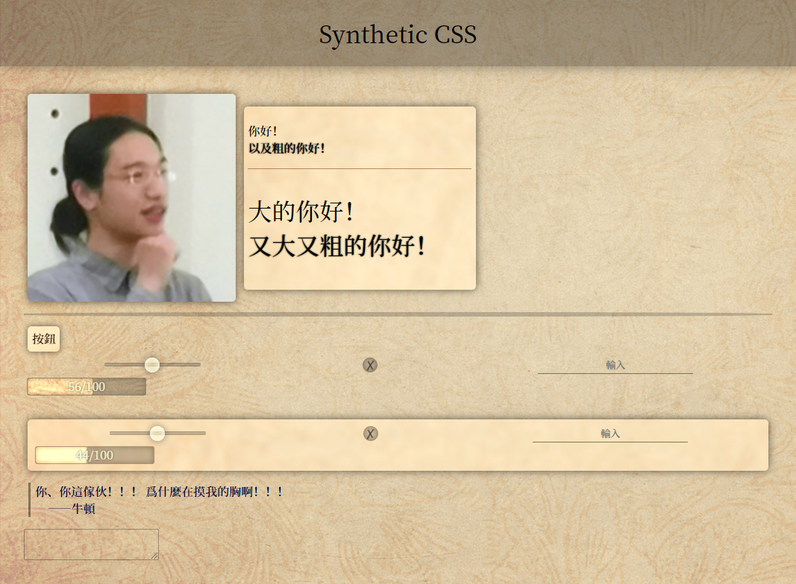

# Synthetic

以Synthetic爲主題的，純粹的美化向CSS。

只需要兩個類 `.syn` 和 `.synth` ，把它們用在不同的標籤上就會有不同的效果。

## 樣例



## 使用方法

直接從github page引用<sub>(網路質量取決於地區)</sub>——

```html
<link rel="stylesheet" href="https://rimochan.github.io/synthetic-css/synthetic.css">
```

或者把這個倉庫clone回去再鏈接`synthetic.css`。

如果你打算把這個css用於本地的html應用，建議鏈接`synthetic_offline.css`。它取消了對google字型api的引用，以保證在有無網路時效果一致。

## 類

`.syn`類會給標籤附上Synthetic風格的基本效果，基本不會影響原本的佈局，只有紋理、陰影等變化。

`.synth`將附加所有效果，可能導致佈局變化。繼承自`.syn`，即不需要和`.syn`同時使用。

## 支持的標籤和效果

`body`
+ syn
    - 添加背景
    - 更換全局字體
+ synth
    - 去除margin
    - 變更內部的strong, b, h1, h2, h3, h4, h5, hr的風格
    
`header`
+ syn
    - 添加背景和陰影
+ synth
    - 變更爲flex佈局並把元素居中

`div`
+ syn
    - 添加背景和陰影
+ synth
    - 添加圓角和內外邊距

`button`, `a`
+ syn
    - 去除原本的樣式
    - 添加背景和陰影
    - 添加懸停和點擊動畫
+ synth
    - 添加圓角和內外邊距
    - 繼承字號

`blockquote`
+ syn
    - 設定顏色
    - 左側添加豎線
+ synth
    - 設定左側邊距

`img`
+ syn
    - 添加圓角
    - 添加陰影
+ synth
    - 添加邊距

`hr`
+ 在body的synth下
    - 改變顏色
+ syn
    - 90%大小
+ synth
    - 不再是90%大小
    - 改變顏色
    - 添加厚度
    - 流線形

`input[type="range"]`
+ syn
    - 去除原本的樣式
    - 設定形狀和大小
    - 爲軸添加凹陷效果
    - 爲按鈕添加半透明效果
    - 懸停時放大

`input[type="checkbox"]`
+ syn
    - 去除原本的樣式
    - 設定形狀和大小
    - 添加半透明效果
    - 嵌入✓✗文字

`input[type="text"]`, `input[type="password"]`
+ syn
    - 去除原本的樣式
    - 設定形狀和顏色
+ synth
    - 去除邊框
    - 文字居中
    - 添加底線
    - 懸停時底線加粗

`textarea`
+ syn
    - 去除原本的樣式
    - 設定形狀和顏色

## 瀏覽器支持

Chrome: 所有效果

Firefox: 所有效果

Edge: (已經換chromium內核了所以和chrome應該是一樣的)

IE: 失去按鈕的濾鏡效果，滑動條不能正常顯示

## 注意

Synthetic使用了太多的特效，可能導致某些貧窮的機器卡住。
